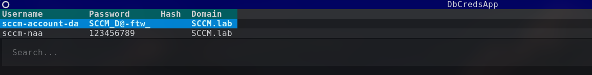
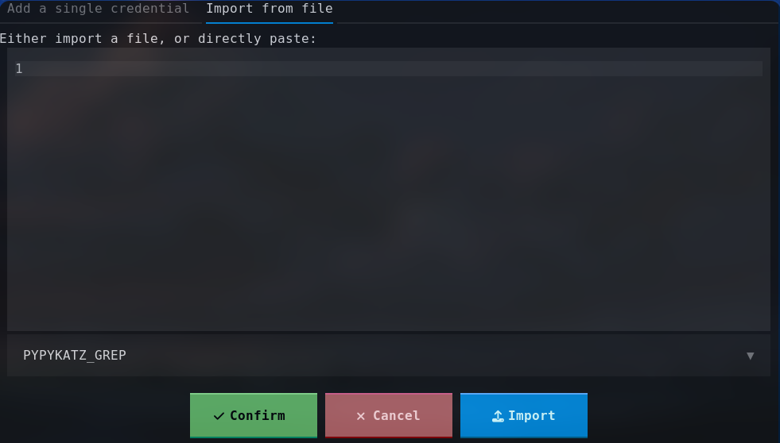
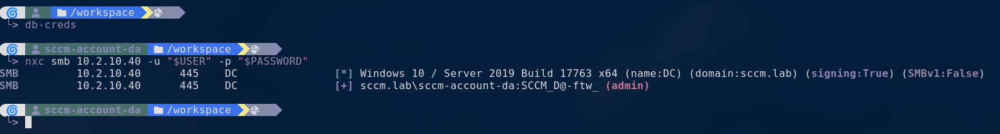

# 📂 DBAssets
DBAssets is a tool to quickly store and retrieve compromised credentials / hosts, the goal is to ease the management of credentials / hosts during a penetration testing engagment or a CTF.

Once an asset is selected from the TUI, the informations can be accessed through environnment variable and don't need to be typed over and over.

For CLI usage, see [Wiki](WIKI.md)

## ⚙️ Install
```
pipx install git+https://github.com/lap1nou/db-assets
```

You can then add those two shell alias in your shell configuration file (`.bashrc`, `.zshrc`, ...):
```bash
alias dbcreds='(){
	CREDS=$(dbassets tui creds);
	export USER=$( echo "$CREDS" | sed "1q;d");
	export PASSWORD=$( echo "$CREDS" | sed "2q;d");
	export NT_HASH=$( echo "$CREDS" | sed "3q;d");
	export DOMAIN=$( echo "$CREDS" | sed "4q;d");
}'
```

```bash
alias dbhosts='(){
	HOSTS=$(dbassets tui hosts);
	export IP=$( echo "$HOSTS" | sed "1q;d");
	export TARGET=$( echo "$HOSTS" | sed "1q;d");
	export HOSTNAME=$( echo "$HOSTS" | sed "2q;d");
}'
```

To see which user you are currently using, you can add the `USER` environnment variable in your prompt, for example with [Starship](https://github.com/starship/starship):
```toml
[env_var]
variable = "USER"
default = ''
style = "fg:bold red bg:#477069"
format = '[  $env_value ]($style)'
```

## ✨ Features
- Add / edit / delete credentials and hosts informations trough a CLI or a TUI
- Import file in various format (CSV, Pypykatz, ...)
- Keybinds customisation

## 🖼️ Screenshots
The TUI (Terminal User Interface):





A typical workflow with `DBAssets`:


## 📝 Configuration
A small configuration file can be used to customise the database name and keybinds for the TUI:
```toml
[paths]
db_name = "DB.kdbx"
db_key_name = "db.key"

[keybindings]
copy_username_clipboard = "f1"
copy_password_clipboard = "f2"
copy_hash_clipboard = "f3"
add_credential = "f4"
delete_credential = "f5"
edit_credential = "f6"
copy_ip_clipboard = "f1"
copy_hostname_clipboard = "f2"
add_host = "f3"
delete_host = "f4"
edit_host = "f5"
quit = "ctrl+c"
```

**The configuration file must be in the home folder, in a `.dbassets` folder.**

## 🛠️ Development

### Running tests
```
poetry run pytest
```
